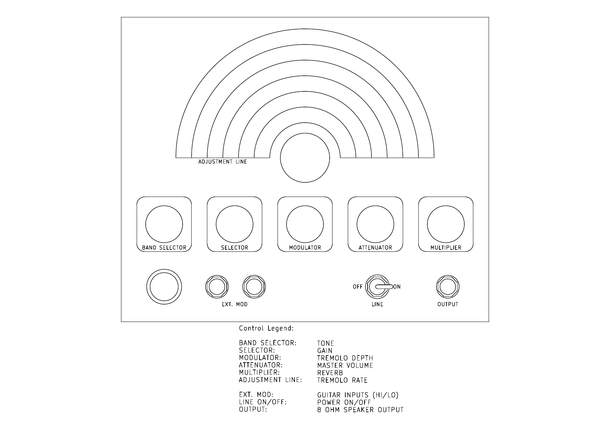

# 12 Watt class AB tube guitar amp

## Built in the chassis of a cool looking vintage A200 signal generator

---

## Features:
- FET input stage for enough gain to get some distortion
- single-knob "tilt" tone control
- reverb
- tremolo
- 6v6 fixed-bias push-pull output stage
- output tubes have individual bias controls

---

## Front panel controls:

